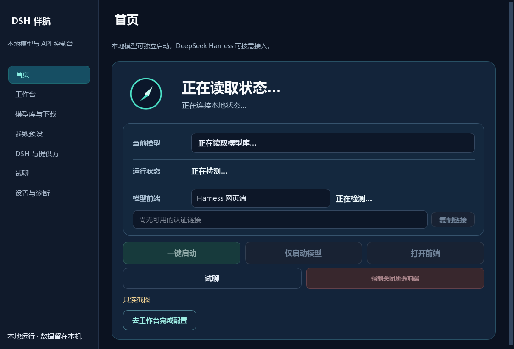

<div align="center">
  

  # DSH 伴航

  **本地模型与多前端控制台，连接 DeepSeek Harness 与 Pi WebUI。**

  简体中文 · [English](README.en.md)

  `v0.2.0` · `Windows x64` · [`MIT`](LICENSE)

  **[下载安装版](https://github.com/toydream525/deepseek-harness-companion/releases/download/v0.2.0/DSH-Companion-Setup-v0.2.0-windows-x64.exe)** · [便携 ZIP](https://github.com/toydream525/deepseek-harness-companion/releases/download/v0.2.0/DSH-Companion-v0.2.0-windows-x64.zip) · **[详细配置说明](docs/GETTING_STARTED.zh-CN.md)** · [项目主页](https://yuriaqua.com/harness)

  <small>模型与运行环境准备见<a href="docs/GETTING_STARTED.zh-CN.md">详细配置说明</a>。</small>
</div>


独立启动 GGUF 本地 API、试聊，需要时再管理 DSH 提供方。Pi WebUI 来自社区 [xing-shuyin/pi-web-ui](https://github.com/xing-shuyin/pi-web-ui)；Harness Desktop 是 DeepSeek 官方程序。

## 能做什么

| 功能 | 在软件里完成 |
|---|---|
| 本地模型 | 添加 GGUF、选择预设、启动/停止、查看就绪状态 |
| 快速试聊 | 验证真实回答，查看生效参数 |
| Harness 提供方与 API | 检测或连接 DSH；添加、编辑、删除本地和云端提供方，配置 API 地址、接口协议与模型列表，安全保存密钥，并设置后续新会话默认模型 |
| 配置迁移 | 一键导入/导出预设与配套配置，缺少文件时重新绑定 |

## 三步开始

1. **安装软件。** 运行上方安装包；使用便携版时，先完整解压 ZIP，再打开 `DSH-Companion.exe`。
2. **准备组件和模型。** 从 [llama.cpp 官方发布页](https://github.com/ggml-org/llama.cpp/releases)获取适合本机的引擎，在软件中选择 `llama-server.exe`；从 Hugging Face 自行下载 GGUF 并添加到模型库。需要 DSH 时，再准备 [Node.js](https://nodejs.org/en/download) 与 [DeepSeek Harness](https://github.com/deepseek-ai/deepseek-harness)。
3. **启动并验证。** 在首页独立启动本地模型，到「试聊」验证回答。DSH、Pi WebUI 和 Harness Desktop 是可选应用，分别管理。

第一次使用请看 [入门与完整配置](docs/GETTING_STARTED.zh-CN.md)。你也可以把 [AI 代配任务](docs/AI_SETUP.zh-CN.md)交给 AI，在本机逐步执行。

## 交给 AI 配置

把下方任务和 [详细配置说明](docs/GETTING_STARTED.zh-CN.md)一起交给能操作你电脑的 AI。模型权重由你从表中的 Hugging Face 页面自行下载；AI 可以复用已有文件，并逐步核实结果。

<details>
<summary>展开并复制完整任务</summary>

```text
请在这台 Windows 电脑实际配置当前稳定版或已安装版 DSH 伴航，不要只给教程。先核对软件实际版本并使用与之匹配的仓库 docs/GETTING_STARTED.zh-CN.md 和 resources/guides/从零配置指南.md：检查系统、CPU/GPU、驱动、内存、显存和已有的 llama.cpp、GGUF、聊天模板、Node.js、DSH；可用资源优先复用，不重复下载或清理旧模型。让我从 README 对应的 Hugging Face 页面自行下载所选 GGUF；你检查完整性并在软件里绑定。缺少其他组件时使用文档列出的官方来源，按实际硬件选引擎和参数，不照搬 RTX 4080 参考值。完成引擎检测、模型入库、可选 Qwen 方案导入与路径重绑、本地 API 启动和真实试聊；若我要用 DSH，再验证认证连接、本地提供方、设为新会话默认以及实际新会话。任何一步失败都给出具体原因和可重试动作。不要读取、输出或上传密钥、DSH 认证链接、聊天记录与个人配置；凭证由我在应用内输入。最后列出已完成、未完成、实际文件版本与路径、仍需我决定的事项；不要默认启用高级实验档。
```

</details>

需要分阶段验收表和故障处理时，打开 [AI 代配详细版](docs/AI_SETUP.zh-CN.md)。

## 可选：一键导入 Qwen 16GB 显存推荐参考方案

软件内可选择「一键导入原提示词配置」，也可用发布包的 `scripts/deploy/` 模式入口。只需自行下载所选档位的 GGUF；固定模板与参数见[详细说明](docs/GETTING_STARTED.zh-CN.md#qwen-参考方案)。

1. 按下表选档位，从对应 Hugging Face 页面**手动下载完整 GGUF**，准备兼容的 llama.cpp 引擎与指南所列模板；已有文件直接复用。
2. 在「模型库与下载」添加文件，然后到「工作台」点「一键导入原提示词配置」，在预览中绑定这台电脑的模型和模板路径；缺少资源会提示，可稍后补齐。
3. 选已绑定预设、启动模型并在「试聊」验证。要用 DSH，再从首页完成本地模型接入 DSH，并在新会话验证。

| 方案 | 模型类型 | 思考 | 适合用途 | 主要取舍 | 模型下载 |
|---|---|---|---|---|---|
| [思考 32K](scripts/deploy/Uncensored32K.cmd) | Huihui 去限制版 | 开启 | 复杂代码、分析、多步任务 | 等待通常更久 | [Huihui IQ3_S](https://huggingface.co/huihui-ai/Huihui-Qwen3.8-27B-abliterated-GGUF/tree/main) |
| [快速 32K（Direct）](scripts/deploy/UncensoredDirect32K.cmd) | Huihui 去限制版 | 关闭 | 日常问答、改写 | 复杂任务建议切思考档 | [Huihui IQ3_S](https://huggingface.co/huihui-ai/Huihui-Qwen3.8-27B-abliterated-GGUF/tree/main) |
| [原版 32K](scripts/deploy/Original32K.cmd) | Qwen 原版（非去限制版） | 开启 | 保留原版行为的通用任务 | 相对去限制版更偏原版响应策略 | [ISTA IQ3_S](https://huggingface.co/ISTA-DASLab/Qwen3.8-27B-GSQ-RCO-GGUF/tree/main) |
| [写作 8K](scripts/deploy/Writing8K-unverified.cmd) | Huihui 去限制版 | 开启 | 写作、改写 | IQ4 文件更大；上下文为 8K | [Huihui UD-IQ4_XS](https://huggingface.co/huihui-ai/Huihui-Qwen3.8-27B-abliterated-GGUF/tree/main) |

<small>32K / 8K 是上下文长度；“去限制版”不代表零拒答或更准确。参考环境：NVIDIA 16GB 显存、64GB 系统内存；其他硬件请按<a href="docs/GETTING_STARTED.zh-CN.md#qwen-参考方案">详细指南</a>调整。</small>

## 文档

| 想做什么 | 打开这里 |
|---|---|
| 第一次安装和日常使用 | [入门与完整配置](docs/GETTING_STARTED.zh-CN.md) |
| Qwen 文件、模板与完整配置 | [参考方案细节](docs/GETTING_STARTED.zh-CN.md#qwen-参考方案) |
| 遇到启动或连接故障 | [常见问题](docs/GETTING_STARTED.zh-CN.md#常见问题) |
| 复现原始 Qwen 部署流程 | [内置从零配置指南](resources/guides/从零配置指南.md) |
| 让 AI 协助配置 | [AI 代配任务](docs/AI_SETUP.zh-CN.md) |
| 从源码构建与发布 | [开源构建说明](docs/OPEN_SOURCE_RELEASE.md) |
| 许可与第三方组件 | [MIT](LICENSE) · [第三方声明](THIRD-PARTY-NOTICES.md) |

DSH 伴航是独立社区项目，与 DeepSeek 没有隶属或背书关系。[DeepSeek Harness 官方项目](https://github.com/deepseek-ai/deepseek-harness)在此。

